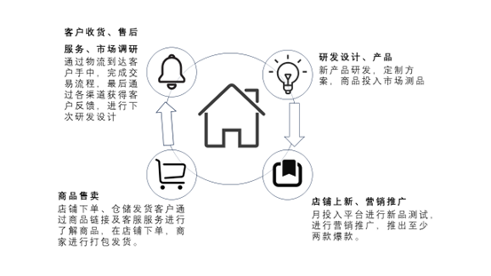
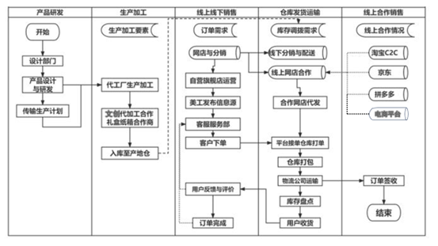

#商业模式

团队秉持着文化能促进消费，消费能传播文化的思想，我们通过宣传浚县庙会的历史底蕴以及文化内涵达到吸引人们购买这种类型的文创产品，进而通过专业设计团队设计庙会相关的文创产品达到对浚县庙会这一传统文化的宣传以及发扬 
项目通过首先利用自媒体平台对浚县庙会这一非物质传统文化进行宣传，提高浚县庙会的知名度，当其达到一定的知名度之后，项目会通过市场调研→设计研发→投入市场（店铺售卖/网络售卖）→商品发货→客户收货→收集客户反馈，闭环循环方式进行运行，不断的推新并投入市场，确保产品顺应时代发展趋势，并通过创新增强自身的竞争力，以防落后被同行打败。
下图是具体的闭环运行流程：

团队成员依据前期市场调研，用户需求分析，制定出详细的产品类型设计图案和参数报告，交由专业的生产厂商，与其商议，确定最后方案，先少量生产， 将新产品交由线上线下店铺进行出售，根据后续反馈情况确定生产后续，上架的商品进行专业的营销推广，保证一定数量的爆款产生。与传统网店营销相同，客户通过淘宝等店铺下单，商家根据订单进行出库包装物流货运，客户收到产品后，团队进行积极的售后服务和反馈信息收集分析，为下次研发进行改良。
同时，我们会在浚县庙会广泛传播的基础上针对浚县推广文旅活动，在我们的调查中浚县具有相当好的文旅条件：浚县庙会被称为“华北第一大古庙会”，有着大伾山、中原奇峰禹贡名山等古迹，1982年以来入选为中华历史文化名城，浚县非遗泥咕咕非常有名，我们在浚县古城发展文旅，不仅可以促进当地经济的发展，而且可以促进浚县古城文化的传播。
#供应链运作模式

#商业模式画布
合作伙伴	关键业务	价值主张	客户关系	客户细分

校哈哈校园经济服务商、
郑州轻投有限公司、蔬派轻食、线下分销商、食品代加工合作、礼盒纸箱合作商	销售农特产品
非遗文创产品售卖
电商育教
培育新农人	

非遗赋能三农
融合创新发展
助力乡村振兴
	
公域+私域双向流量
合作伙伴关系
	

年轻群体、中等收入群体、收藏家群体
	核心资源
高质量的电商旗舰店铺
多个物流公司的支持
有合作关系的美食以及包装公司		渠道通道
微信公众号、视频号、抖音、微博、哔哩哔哩、小红书等自媒体平台；线下合作	
成本结构
特色美食批发成本，产品生产加工成本，电商店铺运营成本，成员走访考察学习成本，产品配送成本，文创产品设计生产制作成本，团队人工成本，非遗资源认定成本	收入来源
销售农特产品、非遗文创产品、花YOUNG品牌产品盈利，自媒体流量变现，线下分销盈利
#打造花YOUNG庙会
我们在花YOUNG品牌下，分设出花YOUNG雕文创、花YOUNG数商兴文化、花YOUNG高定服务平台、花YOUNG庙会特盲盒等多个系列，将浚县庙会与非遗、文旅、盲盒等多次元元素融合，形成“花YOUNG庙会+”的格局。

##（1）花YOUNG品牌设计理念
以浚县庙会为雏形，融入年轻化、趣味化的创意灵感，将浚县庙会和非遗、文创产品、盲盒等巧妙结合，让浚县庙会和文化旅行潮出新花YOUNG，让消费者真正感受到本项目团队时尚潮流、年轻化的设计风格。
##（2）花YOUNG品牌设计内容
	花YOUNG雕文创：以浚县庙会宣传为基础，给予花YOUNG宣传，在花YOUNG宣传的基础上，给予设计宣传图案以一定的非遗元素进行展现，最终形成创意“年俗文化”和创意“民间社火”。
	花YOUNG庙会特盲盒：盲盒的神秘性和未知性给消费者带来神秘、悸动和期待，恰到好处的切中玩家对于未知的好奇心，给购买者一种比较刺激的心理，可激发消费者的购买欲望，从而带来销售量的增长。据此，设计部部门结合热点话题，推出多个系列含文创产品和庙会特色的盲盒，如兔年系列盲盒、春天系列盲盒、国潮农特盲盒等。
	花YOUNG数商兴文化：新电商通过资源、技术、资本等多要素融通，实现了对浚县庙会等相关传统文化上下游的全链渗透，直播变成“新农活”，手机变成“新农具”，数据变成“新农资”，助力传统文化发展。据此，技术部门开发“庙趣横生”电商销售平台，通过将浚县庙会相关文创产品销往全国的方式，在全国范围内推广了浚县庙会这一华北第一大古庙会，并且浚县庙会的宣传为我们后期在浚县开展文旅活动打下了基础。同时，我们以庙会特色为雏形，融入非遗元素，制作幽默有趣的表情包。
	花YOUNG高定服务平台：根据客户画像和时代热点设计出来的套餐，既精确满足了客户的需求，提升客户体验好感度，又体现了我们的社会担当与团队文化。这利于加强客户与我们的互动，建立良好的双向信任关系，形成良好的口碑，打造品牌形象。
##（3）花YOUNG品牌优势
花YOUNG品牌年轻化、个性化、潮流时尚的设计，打破了消费者对庙会特色、非遗文化、文创产品的固有认知，促进庙会特色文创产品和非遗文化的融合发展。
#6.5 运营模式
##6.5.1美食+文旅模式
6.5.2 特色美食+文创设计+电商店铺
##6.5.3传统文化+非遗美食+现代生产技术相结合
---